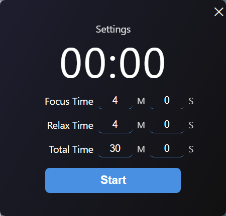
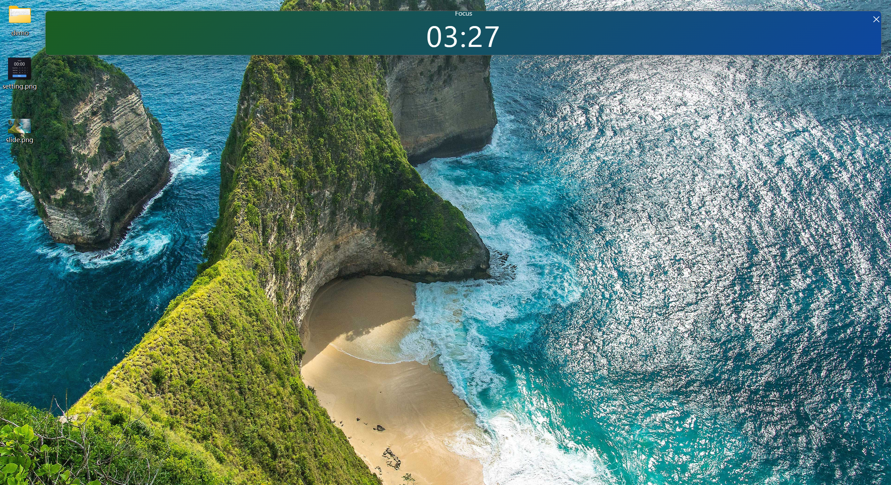
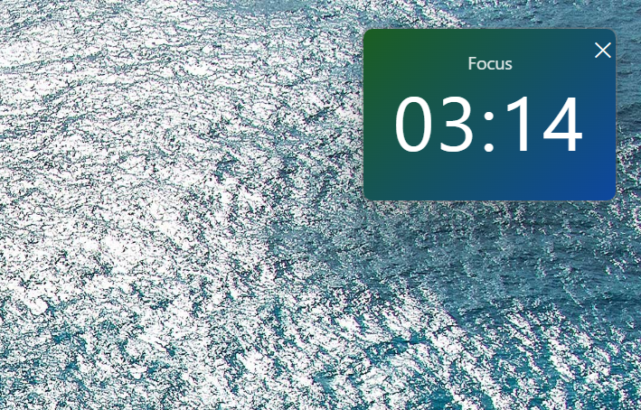
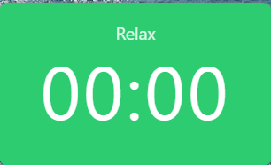
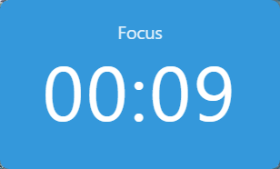
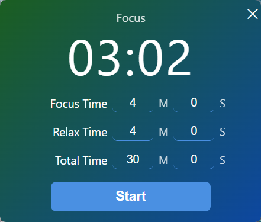
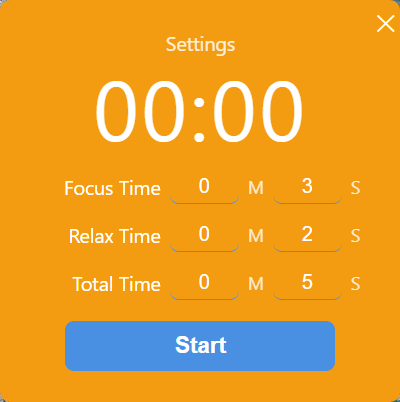

# desktop-timer / 桌面节奏计时器

desktop-timer is a lightweight desktop rhythm timer for focused work on Windows.  
It is designed to stay close to the task itself, helping users manage the rhythm between deep focus and deliberate relaxation without becoming another source of distraction.

desktop-timer 是一个运行在 Windows 桌面的轻量节奏计时器。  
它不是一个喧宾夺主的效率系统，而是一个贴着任务本身运行的桌面提示器，帮助用户在深度专注与主动放松之间建立更健康、更可持续的节奏。

---

## Overview / 项目简介

desktop-timer is built for cognitively demanding work.

When people work on difficult tasks, the real challenge is often not only “how long to focus,” but also:
- how to enter the task without resistance
- how to avoid over-focusing until exhaustion
- how to switch between effort and recovery at the right time
- how to maintain a sustainable output rhythm over a longer period

desktop-timer aims to support exactly that rhythm.

desktop-timer 面向高难度脑力任务场景。

人在处理复杂任务时，真正困难的往往不只是“专注多久”，而是：
- 如何更顺畅地进入任务
- 如何避免一口气冲太狠，之后再也做不动
- 如何在该切换的时候及时从专注转入放松，再重新投入
- 如何把输出节奏维持在长期可持续的状态

desktop-timer 想辅助的，正是这种节奏本身。

---

## Product Positioning / 产品定位

desktop-timer is not a heavy productivity platform.  
It is a low-intrusion desktop companion for task rhythm.

Its goal is not to dominate attention, but to provide:
- visible rhythm cues
- gentle session transitions
- customizable work/rest timing
- light support for long-term focus and creative output

desktop-timer 不是一个功能繁重的效率平台。  
它更像一个低打扰的桌面节奏辅助器。

它的目标不是占据用户注意力，而是提供：
- 清晰但不过度的节奏提示
- 温和的阶段切换提醒
- 可定制的专注/放松时长
- 对长期专注与创造性输出的轻量支持

---

## What Problem It Solves / 它解决什么问题

Many timer tools help users start a countdown, but fewer tools are designed around the actual rhythm of hard thinking.

For difficult mental work, two problems often appear together:
1. users cannot settle into the task and want to quit too early
2. users focus too hard for too long, then become mentally rigid or drained

desktop-timer is designed to sit between these two extremes.

It helps users:
- start more easily
- stay with the task
- switch at the right time
- recover before fatigue accumulates too much
- return to focused work with less friction

很多计时工具能帮用户“开始倒计时”，但很少真正围绕高难度思考任务的节奏来设计。

在困难脑力任务中，常见的两个问题往往同时存在：
1. 人很难真正投入进去，看两眼就想放弃
2. 人会过度专注、长时间硬顶，最后大脑发僵、发疲、失去灵活性

desktop-timer 试图处在这两种极端之间。

它帮助用户：
- 更容易进入任务
- 更稳定地停留在任务上
- 在合适的时候切换
- 在疲劳积累过多之前恢复
- 用更小的阻力重新进入专注

---

## Core Features / 核心功能

- Custom focus time, relax time, and total session time  
- Floating desktop timer that stays close to the work context  
- Frameless, always-on-top window for low-friction visibility  
- Resizable layout that can adapt to different screen placements and aspect ratios  
- Vertical time display when the window becomes very narrow  
- Gentle audiovisual reminders during session transitions  
- Visual flashing cues for focus / relax / completion states  
- Double-click to pause or resume  
- Local offline usage without network dependency  

- 可自定义专注时长、放松时长与总时长  
- 悬浮在桌面的计时器，尽量贴近任务上下文  
- 无边框、置顶窗口，降低查看成本  
- 支持拖拽与缩放，可适配不同屏幕位置与窗口比例  
- 在极窄窗口下可切换为纵向时间显示  
- 阶段切换时提供温和的视听提醒  
- 用颜色闪烁提示专注 / 放松 / 完成等状态切换  
- 支持双击暂停 / 继续  
- 本地运行，无需网络依赖  

---

## Design Highlights / 产品亮点

### 1. Rhythm over raw intensity / 重视节奏，而不是只强调猛冲
The product is designed around the idea that sustainable focus is more valuable than short bursts followed by collapse.

产品强调的是“长期可持续的专注节奏”，而不是短时间猛冲之后迅速耗尽。

### 2. Low intrusion / 低打扰
The timer is meant to support task flow, not compete with it.

It stays visible, but does not demand constant interaction.

它的存在是为了辅助任务和心流，而不是与任务争夺注意力。

它保持可见，但不要求用户频繁操作。

### 3. Visual rhythm cues / 视觉节奏提示
Different session transitions use visual changes to make state switching easier to notice.

不同阶段切换通过视觉变化来降低“我现在该切换了”的识别成本。

### 4. Gentle audio reminder / 温和音效提醒
The sound cue is intended to be noticeable without feeling harsh or disruptive.

音效提醒的目标不是惊扰，而是在不过度打断的前提下提醒用户及时切换。

### 5. Flexible timing logic / 灵活的时长设定
Different tasks require different work/rest rhythms.

Users can define their own focus duration, relax duration, and total duration based on task difficulty and personal rhythm.

不同任务对应的专注—放松节奏并不一样。

用户可以根据任务难度与自身状态，自行设定专注时长、放松时长与总时长。

---

## Design Rationale / 设计依据

desktop-timer is informed by research and design ideas around:
- mental fatigue in prolonged cognitive work
- work-break and recovery design
- task switching and transition cost
- visual and auditory cues for state change and attention guidance

This does **not** claim to be a medical or clinical intervention.  
Instead, it is a product attempt to translate these ideas into a practical desktop tool for daily cognitive work.

desktop-timer 受以下研究与设计思路启发：
- 长时间认知工作的心理疲劳问题
- 工作中断与恢复节奏设计
- 任务切换成本与阶段转换阻力
- 用视觉与听觉线索辅助状态变化和注意定向

它**并不宣称自己是医疗或临床干预工具**。  
更准确地说，它是一次把这些思路转译为日常桌面工具的产品化尝试。

---

## My Role / 我的角色

This is an independently built project.

I was responsible for:
- product concept and problem framing
- interaction and feature design
- desktop application implementation
- iteration of timer behavior and session transitions
- packaging and release for Windows
- project presentation and documentation

这是一个由我独立完成的项目。

我负责了：
- 产品构思与问题定义
- 交互设计与功能设计
- 桌面应用实现
- 计时逻辑与阶段切换体验迭代
- Windows 打包与发布
- 项目展示与文档整理

---

## Tech Stack / 技术栈

- Electron
- HTML / CSS / JavaScript
- electron-builder
- NSIS packaging for Windows
- Local audio reminder (`alert.mp3`)

- Electron
- HTML / CSS / JavaScript
- electron-builder
- Windows 的 NSIS 安装包构建
- 本地音效提醒（`alert.mp3`）

---

## Screenshot / 项目截图

### Settings / 参数设置

Users can set focus time, relax time, and total session time according to the task.

用户可以根据任务特点，自定义专注时长、放松时长和总时长。

---

### Top Placement / 顶部贴边布局

The timer can stay close to the edge of the screen and remain visible without taking over the workspace.

计时器可以贴近屏幕边缘放置，在保持可见的同时，尽量不挤占主要工作区域。

---

### Square Layout / 方形布局

A more compact layout for users who prefer a stable, centered visual anchor.

更紧凑的方形布局，适合希望保持稳定视觉锚点的使用场景。

---

### Slim / Vertical-Friendly Layout / 窄条与纵向友好布局

The timer can adapt to narrow layouts and remain readable in tighter spaces.

计时器可以适应更窄的布局，在较紧凑的空间中仍保持可读性。

---

### Session Transition / 阶段切换提示

Visual transitions help signal that the timer is moving from one state to another.

阶段切换时通过视觉变化提示用户：当前节奏已经进入下一个状态。

---

### Another Transition State / 另一种阶段切换状态

Different transitions are designed to be noticeable while staying lightweight.

不同切换状态都尽量做到“可注意到，但不过度打断”。

---

### Resetting / 重新设定

Users can reopen settings and adjust timing rhythm as task difficulty changes.

用户可以根据任务难度变化重新调整节奏参数，而不是被固定周期绑定。

---

### Session End / 总周期结束

At the end of the full cycle, the product provides a clear closing cue and allows users to reset for the next round.

在总周期结束时，产品会给出明确结束提示，并方便用户重新进入下一轮设定。

---

## How to Run / 运行方式

This project is distributed as a packaged Windows desktop application.  
Download and install the latest release, then launch it by clicking the app icon.

本项目以已打包的 Windows 桌面应用形式发布。  
下载安装最新版软件后，点击应用图标即可运行。
